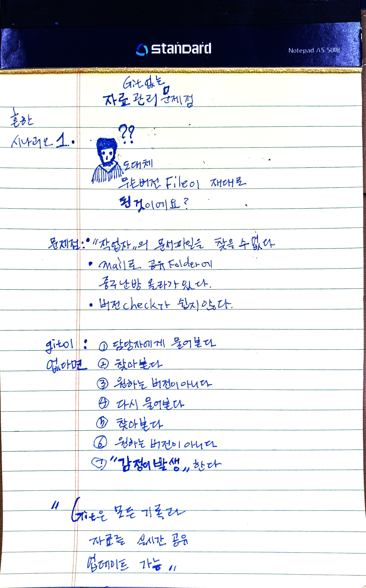
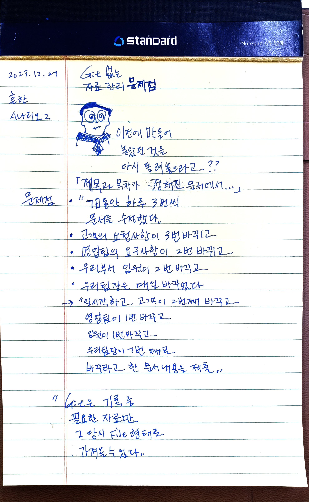
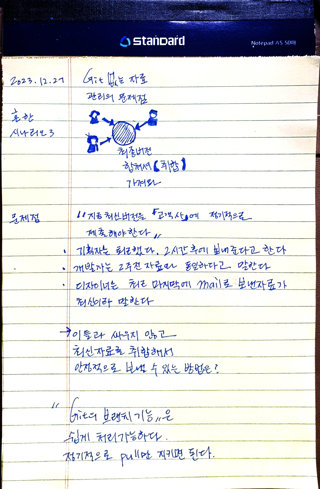

# PM에게 필요한 GIT

~~~
PM에게 git이 반드시 필요한 이유는 크게 2가지이다. 
1. 각종 문서의 이력관리 
2. 개발팀이 만든 결과물이 git으로 관리
~~~

`Git은 Timemachine` 이다.

~~~javascript
                 _-====-__-======-__-========-_____-============-__
               _(                                                 _)
            OO(  time machine: 파일을 "그 때"로 만들어줘!               )_
           0  (_                                                   _)
         o0     (_                                                _)
        o         '=-___-===-_____-========-___________-===-dwb-='
      .o                                _________
     . ______          ______________  |         |      _____
   _()_||__|| ________ |            |  |_________|   __||___||__
  (BNSF 1995| |      | |            | __Y______00_| |_         _|
 /-OO----OO""="OO--OO"="OO--------OO"="OO-------OO"="OO-------OO"=P
#####################################################################
~~~
## 1. git을 사용하는 않는 경우 - 현업 문제점 

### 1.1. 시나리오 - 1

> git으로 관리하지 않는다면 "담당자"에게 메일이나 전화, 오프라인으로 계속 물어보며 원하는 자료를 받을 때까지 꾸준히 대화를 해야 한다. 이것은 프로젝트 진행 시에 "스트레스" 또는 '불만'사항으로 발생한다. 

### 1.2 시나리오 - 2

> git으로 관리하지 않는다면 "버전"관리가 힘들어진다. 단순히 날짜_시간.zip 형태로 공유폴더에 올려놓는 다면 실시간 저장해야 할 시점에서 관리할 수 없는 상황이 발생한다. 그리고 이력관리가 힘들어진다(git은 commit시 메시지로 검색가능하다). 

### 1.3 시나리오 - 3

> 다수의 팀원들이 자신의 최신 자료를 동시에 취합하려고 한다면 git으로 관리해야 안전하다. 
> 메일이나 공유폴더 같은 방법을 사용할 경우, 최신버전을 취합하다가 시간이 간다. 그러나 git으로 각자의 자료를 branch하고 취합시 merge하는 방법을 사용한다면 실시간 취합을 빠르게 할 수 있다. 
